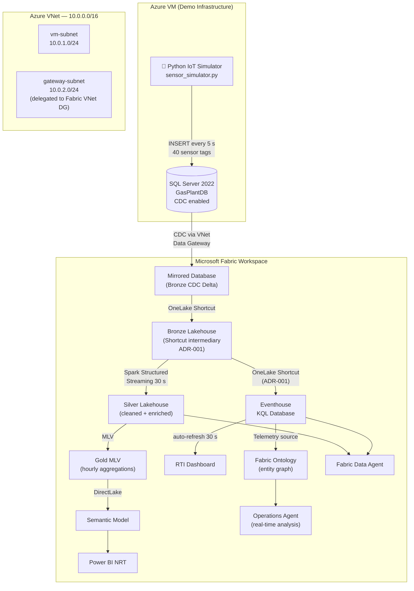

# SQL Server → Microsoft Fabric RTI Demo

**LP Gas Plant — Real-Time Intelligence End-to-End**

A fully self-contained demo that streams simulated LP Gas plant sensor data from a SQL Server database on an Azure VM all the way through Microsoft Fabric Mirroring, a Medallion architecture, Eventhouse KQL, a Real-Time Intelligence dashboard, a Fabric Ontology, and a Fabric Data Agent.

> **No real plant data is used.** All sensor values are generated by the Python IoT simulator included in this repo.

---

## Architecture



---

## Demo Phases

| Phase | What You Build | Key Technologies |
|---|---|---|
| [Phase 1](docs/phases/phase-1-infrastructure.md) | Azure VM + SQL Server + IoT Simulator + VNet DG + Mirroring | Bicep, Python, SQL CDC, Fabric VNet Data Gateway, Fabric Mirroring |
| [Phase 2](docs/phases/phase-2-medallion.md) | Medallion Architecture (Bronze → Silver → Gold) | Spark Structured Streaming, Delta Lake, DirectLake Semantic Model |
| [Phase 3](docs/phases/phase-3-rti.md) | Eventhouse + KQL queries + RTI Dashboard | Fabric Eventhouse, KQL, Real-Time Intelligence Dashboard |
| [Phase 4](docs/phases/phase-4-ontology.md) | Fabric Ontology + Operations Agent | Fabric Ontology (Preview), Semantic Model, DAX, Operations Agent |
| [Phase 5](docs/phases/phase-5-data-agent.md) | Fabric Data Agent | Fabric Data Agent, multi-source AI queries |

---

## Repository Structure

```
sql-server-fabric-rti-demo/
├── infrastructure/
│   ├── bicep/                ← Bicep templates (VNet + VM + SQL Server)
│   │   ├── main.bicep
│   │   ├── network.bicep
│   │   ├── vm.bicep
│   │   └── parameters.json
│   └── scripts/              ← Post-deploy SQL scripts
│       ├── 01-enable-cdc.sql
│       └── 02-create-login.sql
├── simulator/                ← Python IoT sensor data generator
│   ├── sensor_simulator.py
│   ├── config.yaml
│   └── requirements.txt
├── sql/schema/               ← LP Gas Plant database schema + seed data
│   ├── 01-create-database.sql
│   ├── 02-create-tables.sql
│   └── 03-seed-static-data.sql
├── fabric/
│   ├── kql/                  ← KQL scripts for Eventhouse
│   │   ├── eventhouse-schema.kql
│   │   └── sensor-queries.kql
│   ├── notebooks/            ← Spark notebooks (import to Fabric)
│   │   ├── 01-silver-streaming.ipynb  ← Bronze→Silver streaming
│   │   ├── 02-gold-mlv.ipynb          ← Reference (Gold via native MLVs)
│   │   └── 03-seed-dimension-tables.ipynb ← Operational dims in Silver
│   └── ontology/             ← Fabric Ontology configuration notes
│       └── (entity types generated from GasPlant_Ontology_SM)
├── architecture/
│   └── decisions/            ← Architecture Decision Records
│       └── 001-lakehouse-intermediary-for-eventhouse-acceleration.md
└── docs/phases/              ← Step-by-step phase guides
    ├── phase-1-infrastructure.md
    ├── phase-2-medallion.md
    ├── phase-3-rti.md
    ├── phase-4-ontology.md
    └── phase-5-data-agent.md
```

---

## Prerequisites

| Requirement | Notes |
|---|---|
| Azure Subscription | Contributor access; ~$10–15/day for the VM while running |
| Microsoft Fabric workspace | F8 or higher recommended; F2 works for POC |
| Azure CLI (`az`) | [Install guide](https://learn.microsoft.com/en-us/cli/azure/install-azure-cli) |
| Python 3.9+ | For the IoT simulator |
| Git | For cloning and managing this repo |

---

## Quick Start (Phase 1)

### 1 — Clone and deploy infrastructure

```bash
git clone https://github.com/<your-handle>/sql-server-fabric-rti-demo.git
cd sql-server-fabric-rti-demo

# Create resource group (use westus3 if eastus has SKU capacity issues)
az group create --name rg-rtidemo --location westus3

# Deploy VNet + VM + SQL Server (you will be prompted for adminPassword)
az deployment group create \
  --resource-group rg-rtidemo \
  --template-file infrastructure/bicep/main.bicep \
  --parameters infrastructure/bicep/parameters.json \
  --parameters adminPassword="<YourSecureP@ssw0rd>"
```

### 2 — Set up SQL Server (via RDP to the VM)

Connect to the VM public IP via RDP (`sqladmin` / your password), open SSMS, and run scripts in order:

```
sql/schema/01-create-database.sql
sql/schema/02-create-tables.sql
sql/schema/03-seed-static-data.sql
infrastructure/scripts/01-enable-cdc.sql
infrastructure/scripts/02-create-login.sql
```

### 3 — Run the IoT simulator (on the VM)

```cmd
cd C:\demo\simulator
pip install -r requirements.txt
set SQL_CONN_STR=DRIVER={ODBC Driver 17 for SQL Server};SERVER=localhost;DATABASE=GasPlantDB;Trusted_Connection=yes;TrustServerCertificate=yes
python sensor_simulator.py
# Or run as a Scheduled Task — see Phase 1 guide Step 5
```

### 4 — Configure VNet Data Gateway + Mirroring in Fabric

Follow [Phase 1 guide](docs/phases/phase-1-infrastructure.md) to set up the VNet Data Gateway and activate Mirroring.

---

## Architecture Decision Records

- [ADR-001 — Lakehouse Intermediary for Eventhouse Query Acceleration](architecture/decisions/001-lakehouse-intermediary-for-eventhouse-acceleration.md)  
  **TL;DR:** Do not create Eventhouse OneLake Shortcuts pointing directly at a Mirrored Database — the Query Acceleration engine returns a 401. Use a Bronze Lakehouse intermediary instead.

---

## Cost Reference

| Resource | Estimated cost |
|---|---|
| `Standard_D4s_v3` VM (SQL Server Dev) | ~$0.19/hr ($4.56/day) — **auto-shutdown at 22:00 UTC** |
| Fabric F8 capacity | ~$1,048/month (~$1.44/hr) |
| Fabric Mirroring | **Free** — no CU consumption |
| Fabric OneLake Shortcuts | **Free** — metadata only, no data duplication |

---

## License

MIT — see [LICENSE](LICENSE)
